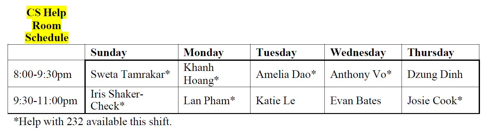

# Computer Science help room

Tutors are available in the evenings to help you on a drop-in basis,
Sunday-Thursday from 8-11 PM in Tome 118. The schedule of tutors is as
follows. Note that the starred tutors are qualified to assist with
COMP232 whereas others are not necessarily qualified for this.

Help Room tutoring is also available remotely during the same hours,
via Microsoft Teams. Please consult the [instructions for how
to access the Help Room remotely](remote-help-rooms.pdf).

----
Last modified: Wed Sep 01 14:34:33 UTC 2021 by jmac.
